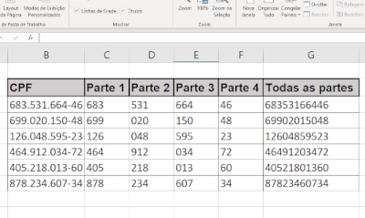

<h2>Aleatório, Fragmentação e Concatenação</h2>

-Crie uma tabela contendo as colunas: CPF, Parte 1, Parte 2, Parte 3, Parte 4, Todas as partes.

-Na coluna CPF, crie números randômicos utilizando alguma função de aleatoriedade. Os números deverão conter 11 algarismos.

-Crie uma formatação desses números para que eles fiquem no padrão de CPF (000.000.000-00).

-Faça a fragmentação de cada parte dos CPFs utilizando alguma função.

-Na coluna "Todas as partes" realize a concatenação das partes.

<h3>Exemplo</h3>

OBS: para melhor prática, utilize formatação adicionando cores e outros recursos.
